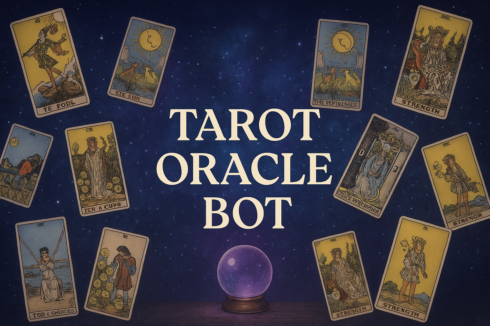

<p align="center">
  
</p>

# 🔮 Tarot Oracle Bot

**Tarot Oracle Bot** is an AI × Tarot project that blends the timeless **Rider–Waite–Smith (RWS)** tarot system with modern **Large Language Models (LLMs)**.
It provides a structured tarot engine for reproducible draws and professional interpretations, with an interactive demo app for exploration.

Whether you’re curious about your past, present, and future, or just want to see how AI interprets the cards, Tarot Oracle Bot offers a playful yet insightful experience.

---

## 🚀 Quick Start

1. **Clone the repo**

   ```bash
   git clone git@github.com:Lucien1999s/tarot-oracle-bot.git
   cd tarot-oracle-bot
   ```

2. **Create `.env` file** with your Google AI Studio API key

   ```bash
   echo "GEMINI_TOKEN=your_api_key_here" > .env
   ```

   👉 Get your key from [Google AI Studio](https://aistudio.google.com/apikey).

3. **Install dependencies**

   ```bash
   pip install -r requirements.txt
   ```

4. **Run the demo app**

   ```bash
   streamlit run streamlit.py
   ```

---

## 📖 Demo Walkthrough

### 1. Choose how many cards to draw

Different spreads give different perspectives:

* **1 card** → core focus / key insight
* **3 cards** → past / present / future
* **5 cards** → issue / action / obstacle / resource / outcome
* **10 cards** → Celtic Cross (full reading of situation, challenges, subconscious, outcome, etc.)


---

### 2. Adjust optional parameters

* **Reversed probability** → chance for a card to appear reversed (default 0.5)
* **Seed** → set a seed to reproduce the same draw (leave empty for random each time)
* **LLM option** → enable AI-powered interpretation if you also provide a question


---

### 3. Enter your question (optional)

On the right-hand side, you can enter your personal question or life concern.

* If **left empty**, the bot will just draw cards.
* If **filled in**, the AI will generate professional tarot interpretations and advice based on the draw.

Click **Draw Cards** to begin!


---

### 4. View the drawn cards

The results section will display your spread, with each card shown in a grid, including:

* Card name
* Orientation (upright/reversed)
* Position meaning (if applicable)


---

### 5. Read the AI interpretation

If you provided a question, the AI tarot master will explain each card and conclude with tailored advice.


---

## 📜 About the Tarot System

This project uses the **Rider–Waite–Smith (RWS) deck**, the most widely recognized tarot standard consisting of **78 cards**:

* **22 Major Arcana** → archetypes and life themes (e.g., The Fool, The Sun, Death).
* **56 Minor Arcana** → four suits (*Wands, Cups, Swords, Pentacles*), each with 14 cards (Ace → King).

Our tarot engine ensures fair random draws (Fisher–Yates shuffle) with optional reproducibility via seeds, and supports multiple spreads for flexible readings.

---

## ⚡ Tech Highlights

* **Core Engine**: RWS deck definitions, spreads, shuffle/draw logic, structured JSON output.
* **AI Layer**: Prompting Gemini (Google Generative AI) for professional interpretations.
* **Assets**: 78 tarot card images mapped to their IDs for display.
* **Extensible**: Designed to integrate with any frontend (not limited to Streamlit).

---

👉 Ready to explore your fate with a mix of tradition and AI?
Clone the repo, run it locally, and start drawing your cards today!
